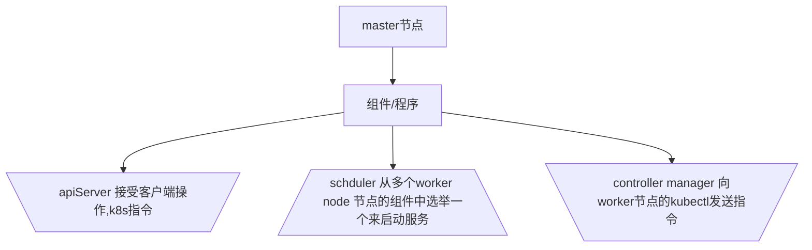
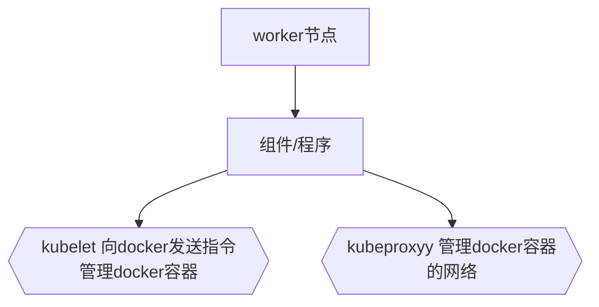

## 概念

### `什么是k8s`

k8s是一组服务器集群

k8s所管理的集群节点上的容器

### `k8s功能`

- 自我修复
- 弹性伸缩：实时更具服务器的并发情况，增加或缩减容器数量
- 自动部署
- 回滚
- 服务发现和负载均衡
- 机密和配置共享管理

### `k8s节点分类`

- master node :主
- worker node: 工作




---  worker node



### `etcd`

 k8s的数据库

用来注册节点、服务、记录账户

### `pod`

pod 是k8s最小部署单元，一个pod中可以有一个或者多个容器 一组容器

pod又称为容器组

### `Controllers`

控制器，控制pod,启动、停止、删除

### `Service`

服务

将一组pod管理起来，提供一个统一的入口

即使pod地址发生改变，这个统一入口也不会变化，可以保证用户访问不受影响

### `label`

标签

一组pod是一个统一的标签

service是通过标签和一组pod进行关联的

### `namespace`

命名空间

用来隔离pod的运行环境【默认情况下，pod是可以相互访问】

使用场景

​       为不同的公司提供隔离的pod运行环境

​      为开发环境、测试环境、生成环境分别准备不同的命名空间，经行隔离


开启worker node 转发

```bash
iptables -P FORWARD ACCEPT
```

